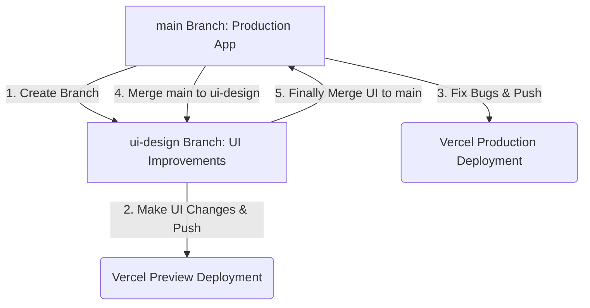

# 🛠️ Git Branching & Workflow Guide (New Aura App)

Yeh guide tumhari help karegi **Core Features (main)** aur **UI Improvements (ui-design)** ko bina kisi conflict ke manage karne me, wo bhi **Antigravity IDE UI** aur **Git Command Line** dono tariko se.

---

## 📌 Workflow Overview (Hoga Kya?)



---

## 1. Branch Kaise Banayein (Initial Setup)
Pehle hamein ek `ui-design` branch banani hai jahan sara naya UI ka kaam hoga.

### 🖱️ IDE UI Se:
1. Bottom-left status bar me **`main`** par click karein.
2. Top dropdown me **`+ Create new branch...`** select karein.
3. Name likhein: `ui-design` aur Enter dabayein.
4. Niche status bar me ab `ui-design` show hoga.

### 💻 Terminal Se:
```bash
# main branch par switch karein
git checkout main

# Latest code pull karein
git pull origin main

# Nayi branch banakar uspar switch karein
git checkout -b ui-design
```

---

## 2. Daily UI Development Workflow
UI branch par kaam karte waqt normal commits aur pushes kaise karein.

### 🖱️ IDE UI Se:
1. UI code likhne ke baad, left panel me **Git Icon (Source Control)** par click karein.
2. Changes ke aage `+` icon par click karke unhe **Stage** karein.
3. Message box me likhein: `feat: styled camera UI` aur **Commit** button daba dein.
4. Branch ko GitHub par push karne ke liye bottom-left me **Sync Changes** button par click karein ya fir git panel ke `...` menu me **Branch -> Publish Branch** select karein.

### 💻 Terminal Se:
```bash
# Changes ko stage karein
git add .

# Commit karein
git commit -m "feat: styled camera UI"

# GitHub par push karein
git push origin ui-design
```

---

## 3. Core Bug Aane Par Context Switch (Stash Workflow)
Agar tum UI par kaam kar rahe ho aur suddenly `main` branch me koi emergency core feature ya bug fix push karna hai:

### 🖱️ IDE UI Se:
1. Git Left Panel ke **`...` (3 dots)** menu par click karein.
2. **Stash** -> **Stash (Include Untracked)** select karein. Isse adhoora UI code temporarily chup jayega.
3. Bottom-left se branch switch karke **`main`** par jayein.
4. Bug fix karein, file stage karein, commit karein aur **Push/Sync** karein. *(Vercel deploy kar dega)*
5. Bug fix hone ke baad, wapas bottom-left se **`ui-design`** branch par switch karein.
6. Git Panel ke **`...`** menu me jayein -> **Stash** -> **Pop Latest Stash** select karein. Tumhara adhoora UI code wapas aa jayega!

### 💻 Terminal Se:
```bash
# UI kaam ko temporary hide karein
git stash -u

# main branch par switch karein
git checkout main

# Bug fix commit aur push karein
git add .
git commit -m "fix: core camera session crash"
git push origin main

# Wapas UI branch par jayein aur kaam wapas layein
git checkout ui-design
git stash pop
```

---

## 4. `main` Branch Ke Changes Ko UI Branch Me Merge Karna
Agar tumne `main` branch par koi naya feature ya bug fix push kiya hai aur tum use `ui-design` branch me lana chahte ho taaki testing kar sako:

### 🖱️ IDE UI Se:
1. Ensure karein ki abhi tum **`ui-design`** branch par ho (bottom-left check karein).
2. Git Panel ke **`...` (3 dots)** menu par jayein.
3. **Branch** -> **Merge Branch...** select karein.
4. List me se **`main`** branch select karein.
5. *Congratulation!* `main` ke saare naye changes ab `ui-design` me merge ho chuke hain.

### 💻 Terminal Se:
```bash
# UI branch par jayein
git checkout ui-design

# main branch ke updates fetch karein
git fetch origin

# local main ya remote main ko merge karein
git merge main
```

---

## 5. UI Ready Hone Par Production Me Launch Karna (Final Step)
Jab tumhara UI poori tarah ready ho jaye aur tum use production app me live karna chahte ho:

### 🖱️ IDE UI Se:
1. Bottom-left status bar se switch karke **`main`** branch par jayein.
2. Git Panel ke **`...` (3 dots)** menu par jayein.
3. **Branch** -> **Merge Branch...** select karein.
4. List me se **`ui-design`** select karein.
5. Merge hone ke baad, bottom-left me **Sync Changes / Push** par click karein.
6. Vercel automatically naya UI live production build me deploy kar dega!

### 💻 Terminal Se:
```bash
# main branch par switch karein
git checkout main
git pull origin main

# UI branch ke changes merge karein
git merge ui-design

# GitHub par push karein
git push origin main
```

---

## 💡 Pro Tips:
* **Preview Links:** Vercel me har pull request ya non-main branch push par ek unique preview link banta hai. Tum `ui-design` push karke Vercel dashboard par jakar uska URL copy karke bina main site ko chede testing kar sakte ho.
* **Merge Conflicts:** Agar main aur UI branch me ek hi line modify hui ho toh merge karte waqt conflict aayega. IDE me visual markers (`Accept Current`, `Accept Incoming`) dikhenge, wahan tum click karke decide kar sakte ho ki konsa code rakhna hai.
